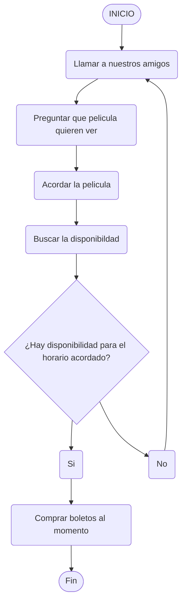

# EJERCICIO 1: Ir al cine
Representa en forma de Diagrama de flujo el algoritmo de ir al cine con tus amigos

```mermaid
flowchart TD
A([INICIO]) --> B
B(Llamar a nuestros amigos) --> C
C(Preguntar que pelicula quieren ver)-->D 
D(Acordar la pelicula)-->E
E(Buscar la disponibildad)-->F
F{¿Hay disponibilidad para el horario acordado?}-->G
G(Si)-->H(Comprar boletos al momento)
F-->I(No)
I--> B
H-->J([Fin])
```
